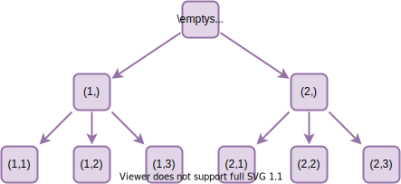
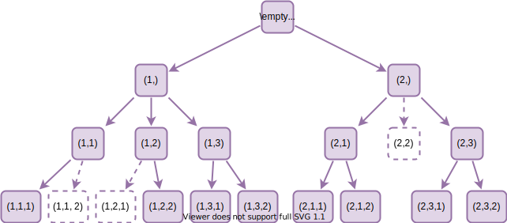

# [Influence Diagram](@id influence-diagram)
## Introduction
Decision programming uses influence diagrams, a generalization of Bayesian networks, to model multi-stage decision problems under uncertainty. This section defines the influence diagrams and discusses their properties. It is based on the definitions in [^1], [^2], and [^3].

## Definition

We define the **influence diagram** as a directed, acyclic graph $G=(C,D,V,I,S).$ We describe the nodes $N=C∪D∪V$ with $C∪D=\{1,...,n\}$ and $n=|C|+|D|$ as follows:

1) **Chance nodes** $C⊆\{1,...,n\}$ (circles) represent uncertain events associated with random variables.
2) **Decision nodes** $D⊆\{1,...,n\}$ (squares) correspond to decisions among discrete alternatives.
3) **Value nodes** $V=\{n+1,...,n+|V|\}$ (diamonds) represent consequences that result from the realizations of random variables at chance nodes and the decisions made at decision nodes.

We define the **information set** $I$ of node $j∈N$ as

$$I(j)⊆\{i∈C∪D∣i<j\}$$

Practically, the information set is a collection of arcs to reverse direction in the graph. The conditions enforce that the graph is acyclic, and there are no arcs from value nodes to other nodes.

In an influence diagram, each chance and decision node $j∈C∪D$ is associates with a finite number of **states** $S_j$ that we encode using integers $S_j=\{1,...,|S_j|\}$ from one to number of states $|S_j|≥1.$ A node $j$ is **trivial** if it has only one state, $|S_j|=1.$ We refer to the collection of all states $S=\{S_1,...,S_n\}$ as the **state space**.

## Root and Leaf Nodes
Chance or decision node is a root node if it is not affected by other chance or decision nodes. Formally, node $j∈C∪D$ is a **root** node if $I(j)=∅.$

Chance or decision node is a leaf node if it does not affect other chance or decision nodes. Formally, node $j∈C∪D$ is a **leaf** node if $j∉I(i)$ for all $i∈C∪D.$

## Drawing Nodes and Arcs

We use a **circle** to represent chance nodes, a **square** to represent decision nodes, and a **diamond** to represent value nodes. The symbol $i$ represents the node's index and symbol $S_i$ the states of the chance or decision node. We use the following colors and styling:

- Chance nodes: Fill color `F5F5F5` and line color `666666`.
- Decision nodes: Fill color `D5E8D4` and line color `82B366`
- Value nodes: Fill color `FFE6CC` and line color `D79B00`
- Linewidth `2pt` and perimeter `2pt` (padding around the node).

We represent directed arcs using arrows from a source node to a target node, colored with the target node's line color. We recommend [diagrams.net](https://www.diagrams.net/) for drawing graphs.

## Drawing Layered Graph

We showed the influence diagram as a linear graph in the [Definition](@ref) section. We can also draw a more concise layered graph, which is better at displaying the influence relationship structure — only nodes at smaller depth influence nodes at greater depth. Also, root and leaf nodes are visible from the layered form.

We define the **depth** of a node $j∈N$ as follows. Root nodes have a depth of one

$$\operatorname{depth}(j)=1,\quad I(j)=∅.$$

Other nodes have a depth of one greater than the maximum depth of its predecessors

$$\operatorname{depth}(j)=\max_{i∈I(j)} \operatorname{depth}(i) + 1,\quad I(j)≠∅.$$

We can then draw the layered graph by grouping the nodes by their depth, ordering the groups by increasing depth and increasing indices order within each group.

## Paths

In influence diagrams, paths represent realizations of states for chance and decision nodes. For example, the above tree represents generating all paths with states $S_1=\{1,2\}$ and $S_2=\{1,2,3\}.$

Formally, a **path** is a sequence of states

$$𝐬=(s_1, s_2, ...,s_n)∈𝐒,$$

where each state $s_i∈S_i$ for all chance and decision nodes $i∈C∪D.$ We denote the set of **paths** as

$$𝐒=∏_{j∈C∪D} S_j=S_1×S_2×...×S_n.$$

We define a **subpath** of $𝐬_A$ with $A⊆C∪D$ is a subsequence

$$𝐬_A=(𝐬_{i}∣i∈A)∈𝐒_A.$$

We denote the set of **subpaths** as

$$𝐒_A=∏_{i∈A} S_i.$$

Notice that $𝐒=𝐒_{C∪D}.$ We define the **number of paths** as

$$|𝐒_A|=∏_{i∈A}|S_i|.$$

We refer to subpath $𝐬_{I(j)}$ as an **information path** and subpaths $𝐒_{I(j)}$ as **information paths** for a node $j∈N.$

## Effective Paths

It is possible for some combinations of chance or decision states to be unrealizable. We refer to such subpaths as ineffective. For example, the above tree represents the generation of paths where subpaths $𝐒_{\{1,2\}}^′=\{(2,2)\}$, $𝐒_{\{1,2,3\}}^′=\{(1,1,2), (1,2,1)\}$ are ineffective.

Formally, the path $𝐬$ is **ineffective** if and only if $𝐬_A∈𝐒_A^′$ given ineffective subpaths $𝐒_A^′⊆𝐒_A$ for nodes $A⊆C∪D.$ Then, **effective paths** is a subset of all paths without ineffective paths

$$𝐒^∗=\{𝐬∈𝐒∣𝐬_{A}∉𝐒_{A}^′\}⊆𝐒.$$

If effective paths is empty, the influence diagram has no solutions.

## Probabilities
Each chance node is associated with a discrete probability distribution over its states for every information path. Formally, for each chance node $j∈C$, we denote the **probability** of state $s_j$ given information path $𝐬_{I(j)}$ as

$$ℙ(X_j=s_j∣X_{I(j)}=𝐬_{I(j)})∈[0, 1],$$

with

$$∑_{s_j∈S_j} ℙ(X_j=s_j∣X_{I(j)}=𝐬_{I(j)}) = 1.$$

We refer to chance state with given information path as **active** if its probability is nonzero

$$ℙ(X_j=s_j∣X_{I(j)}=𝐬_{I(j)})>0.$$

Otherwise, it is **inactive**.

## Decision Strategies
Each decision strategy models how the decision maker chooses a state $s_j∈S_j$ given an information path $𝐬_{I(j)}$ at decision node $j∈D.$ Decision node is a special type of chance node, such that the probability of the chosen state given an information path is fixed to one

$$ℙ(X_j=s_j∣X_{I(j)}=𝐬_{I(j)})=1.$$

By definition, the probabilities for other states are zero.

Formally, for each decision node $j∈D,$ a **local decision strategy** is function that maps an information path $𝐬_{I(j)}$ to a state $s_j$

$$Z_j:𝐒_{I(j)}↦S_j.$$

**Decision strategy** $Z$ contains one local decision strategy for each decision node. Set of **all decision strategies** is denoted $ℤ.$

## Path Probability
The probability distributions at chance and decision nodes define the probability distribution over all paths $𝐒,$ which depends on the decision strategy $Z∈ℤ.$ We refer to it as the path probability

$$ℙ(𝐬∣Z) = ∏_{j∈C∪D} ℙ(X_j=𝐬_j∣X_{I(j)}=𝐬_{I(j)}).$$

We can decompose the path probability into two parts

$$ℙ(𝐬∣Z) = p(𝐬) q(𝐬∣Z).$$

The first part consists of the probability contributed by the chance nodes. We refer to it as the **upper bound of path probability**

$$p(𝐬) = ∏_{j∈C} ℙ(X_j=𝐬_j∣X_{I(j)}=𝐬_{I(j)}).$$

The second part consists of the probability contributed by the decision nodes.

$$q(𝐬∣Z) = ∏_{j∈D} ℙ(X_j=𝐬_j∣X_{I(j)}=𝐬_{I(j)}).$$

Because the probabilities of decision nodes are defined as one or zero depending on the decision strategy, we can simplify the second part to an indicator function

$$q(𝐬∣Z)=\begin{cases}
1, & Z(𝐬) \\
0, & \text{otherwise}
\end{cases}.$$

The expression $Z(𝐬)$ indicates whether a decision stategy is **compatible** with the path $𝐬,$ that is, if each local decision strategy chooses a state on the path. Formally, we have

$$Z(𝐬) ↔ ⋀_{j∈D} (Z_j(𝐬_{I(j)})=𝐬_j).$$

Now the **path probability** equals the upper bound if the path is compatible with given decision strategy. Otherwise, the path probability is zero. Formally, we have

$$ℙ(𝐬∣Z)=
\begin{cases}
p(𝐬), & Z(𝐬) \\
0, & \text{otherwise}
\end{cases}.$$

## Active Paths
A path is active if all of its subpaths are active

$$X(𝐬)↔(p(𝐬)>0)↔⋀_{j∈C} (ℙ(X_j=𝐬_j∣X_{I(j)}=𝐬_{I(j)})>0).$$

The path probability of **inactive** paths is fixed to zero, irrespective of the decision strategy.

The set of **active paths** is

$$𝐒(X)=\{𝐬∈𝐒 ∣ X(𝐬)\}.$$

The number of active paths is

$$|𝐒(X)|≤|𝐒|.$$

## Compatible Paths
We denote the set of **compatible paths** as

$$𝐒(Z)=\{𝐬∈𝐒 ∣ Z(𝐬)\}.$$

Since each decision strategy $Z_j$ chooses only one of its states, the **number of compatible paths** is a constant

$$|𝐒(Z)|=|𝐒|/\prod_{j∈D}|S_j|=\prod_{j∈C}|S_j|.$$

## Forbidden Paths

## Active-Compatible Paths

$$𝐒(X)∩𝐒(Z)=\{𝐬∈𝐒∣X(𝐬)∧Z(𝐬)\}$$

$$|𝐒(X)∩𝐒(Z)|≤|𝐒(Z)|$$

---

If all paths are active $𝐒(X)↔T$ then

$$𝐒(X)∩𝐒(Z)=𝐒(Z)$$

---

We denote the set of **active paths** given a decision strategy $Z$ as

$$𝐒^+(Z)=\{𝐬∈𝐒 ∣ ℙ(𝐬∣Z)>0\}.$$

$$=\{𝐬∈𝐒(Z) ∣ p(𝐬)>0\}$$

By definition, the active paths is a subset of compatible paths. Therefore, the **number of active paths** is bounded by the number of compatible paths

$$|𝐒^+(Z)|≤|𝐒(Z)|.$$

If an influence diagram has **zero inactive chance states** the number of active paths is equal to the number of compatible paths

$$|𝐒^+(Z)|=|𝐒(Z)|.$$

Otherwise, the number of active paths is less than the number of compatible paths.

## Consequences
For each value node $j∈V$, we define the **consequence** given information path $𝐬_{I(j)}$ as

$$Y_j:𝐒_{I(j)}↦ℂ,$$

where $ℂ$ is the set of real-valued consequences.

## Path Utility
The **utility function** is a function that maps consequences to real-valued utility

$$U:ℂ^{|V|}↦ℝ.$$

The **path utility** is defined as the utility function acting on the consequences of value nodes given their information paths

$$\mathcal{U}(𝐬) = U(\{Y_j(𝐬_{I(j)}) ∣ j∈V\}).$$

The **default path utility** is the sum of consequences

$$\mathcal{U}(𝐬) = ∑_{j∈V} Y_j(𝐬_{I(j)}).$$

The utility function, in this case, corresponds to the sum of the elements.

The utility function affects the objectives discussed [Decision Model](@ref decision-model) page. We can choose the utility function such that the path utility function either returns:

* a numerical value, which leads to a mixed-integer linear programming (MILP) formulation or
* a linear function with real and integer-valued variables leads to a mixed-integer quadratic programming (MIQP) formulation.

Different formulations require a solver capable of solving them.

## Path Distribution
A **path distribution** is a pair

$$(ℙ(𝐬∣Z), \mathcal{U}(𝐬))$$

that comprises of path probability function and path utility function over paths $𝐬∈𝐒$ conditional to the decision strategy $Z.$

## Symmetry
An influence diagram is **symmetric** if the number of active paths is a constant, that is, independent of the decision strategy. Otherwise, it is **asymmetric**. With the figures below, we demonstrate both of these properties.

Consider the influence diagram with two nodes. The first is a decision node with two states, and the second is a chance node with three states.

If there are no inactive chance states, all paths are possible. That is, for all $s∈S,$ we have $p(s)>0.$ In this case, the influence diagram is symmetric.

However, if there are inactive chance states, such as $ℙ(s_2=2∣s_1=2)=0$, we can remove $(2,2)$ from the paths, visualized by a dashed shape. Therefore, there is a varying number of possible paths depending on whether the decision-maker chooses state $s_1=1$ or $s_1=2$ in the first node, and the influence diagram is asymmetric.

Let us add one chance node with two states to the influence diagram.

Now, given inactive chance states such that we remove the dashed paths, we have a symmetric influence diagram. Both decisions will have an equal number of possible paths. However, there are only eight possible paths instead of twelve if there were no inactive chance states.

## Properties
In this section, we define more properties for influence diagrams.

**Discrete** influence diagram refers to countable state space. Otherwise, the influence diagram is **continuous**. We can discretize continuous influence diagrams using discrete bins.

Two nodes are **sequential** if there exists a directed path from one node to the other in the influence diagram. Otherwise, the nodes are **parallel**. Sequential nodes often model time dimension.

**Repeated subdiagram** refers to a recurring pattern within an influence diagram. Often, influence diagrams do not have a unique structure, but they consist of a repeated pattern due to the underlying problem's properties.

**Limited-memory** influence diagram refers to an influence diagram where an upper bound limits the size of the information set for decision nodes. That is, $I(j)≤m$ for all $j∈D$ where the limit $m$ is less than $|C∪D|.$ Smaller limits of $m$ are desirable because they reduce the decision model size, as discussed in the [Computational Complexity](@ref computational-complexity) page.

**Isolated subdiagrams** refer to an influence diagram that consists of multiple unconnected diagrams. That is, there are no undirected connections between the diagrams. Therefore, one isolated subdiagram's decisions affect decisions on the other isolated subdiagrams only through the utility function.

Chance or decision node is **redundant** if it is a leaf node and not in any value node's information set. Formally, if $j∈C∪D$ is a leaf node and there does not exist a value node $i∈V$ such that $j∈I(i).$

## References
[^1]: Salo, A., Andelmin, J., & Oliveira, F. (2019). Decision Programming for Multi-Stage Optimization under Uncertainty, 1–35. Retrieved from [http://arxiv.org/abs/1910.09196](http://arxiv.org/abs/1910.09196)

[^2]: Howard, R. A., & Matheson, J. E. (2005). Influence diagrams. Decision Analysis, 2(3), 127-143. https://doi.org/10.1287/deca.1050.0020

[^3]: Shachter, R. D. (1986). Evaluating influence diagrams. Operations research, 34(6), 871-882. https://doi.org/10.1287/opre.34.6.871
