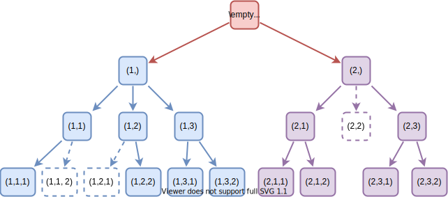

# [Paths and Properties](@id paths-and-properties)
## Effective Paths

It is possible for some combinations of chance or decision states to be unrealizable. We refer to such subpaths as ineffective. For example, the above tree represents the generation of paths where subpaths $𝐒_{\{1,2\}}^′=\{(2,2)\}$, $𝐒_{\{1,2,3\}}^′=\{(1,1,2), (1,2,1)\}$ are ineffective.

Formally, the path $𝐬$ is **ineffective** if and only if $𝐬_A∈𝐒_A^′$ given ineffective subpaths $𝐒_A^′⊆𝐒_A$ for nodes $A⊆C∪D.$ Then, **effective paths** is a subset of all paths without ineffective paths

$$𝐒^∗=\{𝐬∈𝐒∣𝐬_{A}∉𝐒_{A}^′\}⊆𝐒.$$

The [Decision Model](@ref decision-model) size depends on the number of effective paths, rather than the number of paths or size of the influence diagram directly. If effective paths is empty, the influence diagram has no solutions.

## Active Paths
If the upper bound of path probability is zero, its probability is zero, and it does not affect the solution. Therefore, we can only consider paths with a positive upper bound of path probability. We refer to these paths as active paths. Formally, we define an **active path** as a path $𝐬$ if all of its chance states are active

$$\begin{aligned}
X(𝐬)&↔(p(𝐬)>0)\\ &↔ ⋀_{j∈C} (ℙ(X_j=𝐬_j∣X_{I(j)}=𝐬_{I(j)})>0).
\end{aligned}$$

Otherwise, it is an **inactive path**. We denote the set of **active paths** as

$$𝐒(X)=\{𝐬∈𝐒 ∣ X(𝐬)\}.$$

The **number of active paths** is

$$|𝐒(X)|≤|𝐒|.$$

Effective paths are related to active paths, such that, for all $j∈C,$ we have ineffective subpaths

$$𝐒_{I(j)∪j}^′=\{𝐬_{I(j)∪j}∈𝐒_{I(j)∪j} ∣ ℙ(X_j=𝐬_j∣X_{I(j)}=𝐬_{I(j)})=0\}.$$

Generally, we have

$$𝐒^∗ ⊆ 𝐒(X).$$

If there are no other ineffective subpaths, we have

$$𝐒^∗ = 𝐒(X).$$

## Compatible Paths
Each decision strategy $Z∈ℤ$ chooses a set of paths from all paths, referred to as compatible paths. Formally, we denote the set of **compatible paths** as

$$𝐒(Z)=\{𝐬∈𝐒 ∣ Z(𝐬)\}.$$

Since each local decision strategy $Z_j∈Z$ can choose only one of its states, the **number of compatible paths** is

$$|𝐒(Z)|=|𝐒|/|𝐒_D|=|𝐒_C|.$$

The compatible paths of all distinct pairs of decision strategies are disjoint. Formally, for all $Z,Z^′∈ℤ$ where $Z≠Z^′$, we have $Z(𝐬)∧Z^′(𝐬)↔⊥,$ which gives as

$$𝐒(Z)∩𝐒(Z^′)=\{𝐬∈𝐒∣Z(𝐬)∧Z^′(𝐬)\}=∅.$$

## Symmetry
We define the set of active and compatible paths as

$$𝐒(X)∩𝐒(Z)=\{𝐬∈𝐒∣X(𝐬)∧Z(𝐬)\}.$$

An influence diagram is **symmetric** if the number of active and compatible paths is a constant. Formally, if for all $Z,Z^′∈ℤ,$ where $Z≠Z^′,$ we have

$$|𝐒(X)∩𝐒(Z)|=|𝐒(X)∩𝐒(Z^′)|.$$

For example, if all paths are active $X(𝐬)↔⊤,$ we have $|𝐒(X)∩𝐒(Z)|=|𝐒(Z)|,$ which is a constant. Otherwise, the influence diagram is **asymmetric**. The figures below demonstrate symmetric and asymmetric influence diagrams.

### Example 1

Consider the influence diagram with two nodes. The first is a decision node with two states, and the second is a chance node with three states.

If there are no inactive chance states, all paths are possible. That is, for all $s∈S,$ we have $p(s)>0.$ In this case, the influence diagram is symmetric.

### Example 2

However, if there are inactive chance states, such as $ℙ(s_2=2∣s_1=2)=0$, we can remove $(2,2)$ from the paths, visualized by a dashed shape. Therefore, there is a varying number of possible paths depending on whether the decision-maker chooses state $s_1=1$ or $s_1=2$ in the first node, and the influence diagram is asymmetric.

### Example 3

Let us add one chance node with two states to the influence diagram.

Now, given inactive chance states such that we remove the dashed paths, we have a symmetric influence diagram. Both decisions will have an equal number of possible paths. However, there are only eight possible paths instead of twelve if there were no inactive chance states.

## Local Decision Strategy Defining Set
*Local decision strategy  defining set* refers to a subset of paths that include the subpath $(s_{I(j)}, s_j)$ and thus, represent the decision alternative $s_{I(j)} \rightarrow s_j$ for decision node $j \in D$. Formally, it includes all the paths

$$ 𝐒_{s_j \mid s_{I(j)}} = \{ s \in 𝐒 \mid (s_{I(j)}, s_j) ⊂ s\}.

## Other Properties
In this section, we define more properties for influence diagrams.

**Discrete** influence diagram refers to countable state space. Otherwise, the influence diagram is **continuous**. We can discretize continuous influence diagrams using discrete bins.

Two nodes are **sequential** if there exists a directed path from one node to the other in the influence diagram. Otherwise, the nodes are **parallel**. Sequential nodes often model time dimension.

**Repeated subdiagram** refers to a recurring pattern within an influence diagram. Often, influence diagrams do not have a unique structure, but they consist of a repeated pattern due to the underlying problem's properties.

**Limited-memory** influence diagram refers to an influence diagram where an upper bound limits the size of the information set for decision nodes. That is, $I(j)≤m$ for all $j∈D$ where the limit $m$ is less than $|C∪D|.$ Smaller limits of $m$ are desirable because they reduce the decision model size, as discussed on the [Computational Complexity](@ref computational-complexity) page.

**Isolated subdiagrams** refer to unconnected diagrams within an influence diagram. That is, there are no undirected connections between the diagrams. Therefore, one isolated subdiagram's decisions affect decisions on the other isolated subdiagrams only through the utility function.

A chance or decision node is **redundant** if it is a leaf node and not in any value node's information set. Formally, if $j∈C∪D$ is a leaf node and there does not exist a value node $i∈V$ such that $j∈I(i)$, then node $j$ is redundant.
