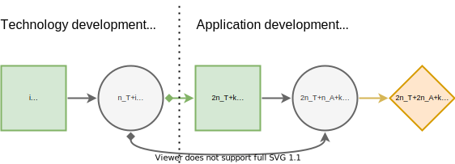

# Contingent Portfolio Programming
## Description
[^1], section 4.2

> For instance, assume that the first-stage decisions specify which technology development projects will be started to generate patent-based intellectual property ( P ) for a platform. This intellectual property contributes subject to some uncertainties to the technical competitiveness ( T ) of the platform. In the second stage, it is possible to carry out application ( A ) development projects which, when completed, yield cash flows that depend on the market share of the platform. This market share ( M ) depends on the competitiveness of the platform and the number of developed applications. The aim is to maximize the cash flows from application projects less the cost of technology and application development projects.

## Formulation
### Projects

The influence diagram of the contingent portfolio programming (CPP) problem. NOTE: the ID needs to be edited so that there's no $i$ and $k$. Basically, the decision nodes represent decisions on which $i$ and $k$ to pick.

There are $n_T$ technology development projects and $n_A$ application development projects.

Decision states to develop patents

$$d_i^P∈D_i^P=\{[q_1^P, q_2^P], [q_2^P, q_3^P], ..., [q_{|D^P|}^P, q_{|D^P|+1}^P]\}$$

Chance states of technical competitiveness $c_i^T∈C_i^T$

Decision states to develop applications

$$d_k^A∈D^A=\{[q_1^A, q_2^A], [q_2^A, q_3^A], ..., [q_{|D^A|}^A, q_{|D^A|+1}^A]\}$$

Chance states of market size $c_k^M∈C_k^M$

Probability of technical competitiveness $c_j^T$ given the range $d_i^P$: $ℙ(c_j^T∣d_i^P)∈[0,1]$

Probability of market share $c_l^M$ given the technical competitiveness $c_j^T$ and range $d_k^A$: $ℙ(c_l^M∣c_j^T,d_k^A)∈[0,1]$

### Portfolio Selection
Technology project $t$ costs $I_t∈ℝ^+$ and generates $O_t∈ℕ$ patents.

Application project $a$ costs $I_a∈ℝ^+$ and generates $O_a∈ℕ$ applications. If completed, provides cash flow $V(a|c_l^M)∈ℝ^+.$

Decision variables $x^T(t)∈\{0, 1\}$ indicate which technologies are selected.

Decision variables $x^A(a∣d_i^P,c_j^T)∈\{0, 1\}$ indicate which applications are selected.

Number of patents $x^T(t) = ∑_i x_i^T(t) z(d_i^P)$

Number of applications $x^A(a∣d_i^P,c_j^T) = ∑_k x_k^A(a∣d_i^P,c_j^T) z(d_k^A|d_i^P,c_j^T)$

Constraints

$$∑_t x_i^T(t) \le z(d_i^P)n_T, \quad \forall i$$

$$∑_a x_k^A(a∣d_i^P,c_j^T) \le z(d_i^P)n_A, \quad \forall i,j,k$$

$$∑_a x_k^A(a∣d_i^P,c_j^T) \le z(d_k^A|d_i^P,c_j^T)n_A, \quad \forall i,j,k$$

$$q_i^P - (1-z(d_i^P))M \le \sum_t x_i^T(t)O_t \le q_{i+1}^P + (1-z(d_i^P))M - 𝝐, \quad \forall i$$

$$q_k^A - (1-z(d_k^A|d_i^P,c_j^T))M \le \sum_a x_k^A(a∣d_i^P,c_j^T)O_a \le q_{k+1}^A + (1-z(d_k^A|d_i^P,c_j^T))M - 𝝐, \quad \forall i,j,k$$

$$x_i^T(t)∈\{0, 1\}, \quad \forall i$$

$$x_k^A(a∣d_i^P,c_j^T)∈\{0, 1\}, \quad \forall i,j,k$$

Large constant $M$ (e.g. $\frac{3}{2}\text{max}\{\sum_t O_t,\sum_a O_a\}$)

Small constant $\varepsilon$ = $\frac{1}{2}\text{min}\{O_t, O_a\}$

Path utility

$$\mathcal{U}(s) = \sum_a x_k^A(a∣d_i^P,c_j^T) (V(a|c_l^M) - I_a) - ∑_t x_i^T(t) I_t$$

## References
[^1]: Salo, A., Andelmin, J., & Oliveira, F. (2019). Decision Programming for Multi-Stage Optimization under Uncertainty, 1–35. Retrieved from [http://arxiv.org/abs/1910.09196](http://arxiv.org/abs/1910.09196)
