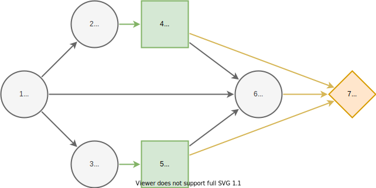

# N-Monitoring Problem
## Description
The $N$-monitoring problem is described in [^1], sections 4.1 and 6.1.

## Formulation

The $2$-monitoring problem.

The incluence diagram of generalized $N$-monitoring problem where $N≥1$ and indices $k=1,...,N.$ The nodes are associated with states as follows. **Load state** $L=\{high, low\}$ denotes the load, **report states** $R_k=\{high, low\}$ report the load state to the **action states** $A_k=\{yes, no\}$ which decide whether to fortificate **failure state** $F=\{failure, success\}.$ Finally, the utility at target $T$ depends on the whether $F$ fails and the fortification costs.

We draw the magnitude and cost of fortification $c_k∼U(0,1)$ from a uniform distribution. Fortification is defined

$$f(A_k) =
\begin{cases}
c_k, & A_k=yes \\
0, & A_k=no
\end{cases}$$

The probability that the load is high. We draw $x∼U(0,1)$ from uniform distribution.

$$ℙ(L=high)=x$$

The probabilities of the report states correspond to the load state. We draw the values $x∼U(0,1)$ and $y∼U(0,1)$ from uniform distribution.

$$ℙ(R_k=high∣L=high)=\max\{x,x-1\}$$

$$ℙ(R_k=low∣L=low)=\max\{y,y-1\}$$

The probabilities of failure which are decresead by fortifications. We draw the values $z∼U(0,1)$ and $w∼U(0,1)$ from uniform distribution.

$$ℙ(F=failure∣A_N,...,A_1,L=high)=\frac{z}{\exp(∑_{k=1,...,N} f(A_k))}$$

$$ℙ(F=failure∣A_N,...,A_1,L=low)=\frac{w}{\exp(∑_{k=1,...,N} f(A_k))}$$

Utility from consequences at target $T$ from failure state $F$

$$U(Y(F)) =
\begin{cases}
100, & F = success \\
0, & F = failure
\end{cases}$$

Utility from consequences at target $T$ from action states $A_k$

$$U(Y(A_k))=
\begin{cases}
-c_k, & A_k=yes \\
0, & A_k=no
\end{cases}$$

Total utility at target $T$

$$U(Y(F,A_N,...,A_1))=U(Y(F))+∑_{k=1,...,N} U(Y(A_k)).$$

## References
[^1]: Salo, A., Andelmin, J., & Oliveira, F. (2019). Decision Programming for Multi-Stage Optimization under Uncertainty, 1–35. Retrieved from [http://arxiv.org/abs/1910.09196](http://arxiv.org/abs/1910.09196)
