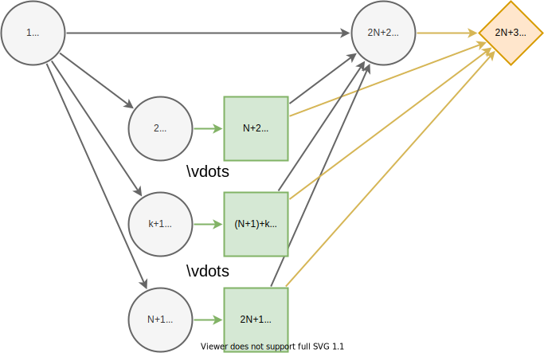

# N-Monitoring Problem
## Description
The $N$-monitoring problem is described in [^1], sections 4.1, 6.1.

## Formulation

The $2$-monitoring problem.

The generalized $N$-monitoring problem.

Diagram $N≥1$ $k=1,...,N$

States

- Load states $L$ are *low* and *high*
- Action states $A_k$ are the decisions to fortificate, *no* and *yes*
- Failure states $F$ are *failure* and *success*
- Report state $R_k$ reports the load state, *low* and *high*
- Target $T$

Utility

- Failure $0$
- Success $100$
- Fortification costs

Probabilities

$$x∼U(0,1)$$

$$ℙ(L=high)=x$$

$$y∼U(0,1)$$

$$ℙ(R_k=high∣L=high)=\max\{y,y-1\}$$

$$ℙ(R_k=low∣L=low)=\max\{y,y-1\}$$

$$z,w∼U(0,1)$$

$$c_k∼U(0,1)$$

$$
f(A_k) =
\begin{cases}
0, & A_k=no \\
c_k, & A_k=yes
\end{cases}
$$

$$ℙ(F=failure∣L=high, A_1,...,A_N)=\frac{z}{\exp(∑_{k=1,...,N} f(A_k))}$$

$$ℙ(F=failure∣L=low, A_1,...,A_N)=\frac{w}{\exp(∑_{k=1,...,N} f(A_k))}$$

## References
[^1]: Salo, A., Andelmin, J., & Oliveira, F. (2019). Decision Programming for Multi-Stage Optimization under Uncertainty, 1–35. Retrieved from [http://arxiv.org/abs/1910.09196](http://arxiv.org/abs/1910.09196)
